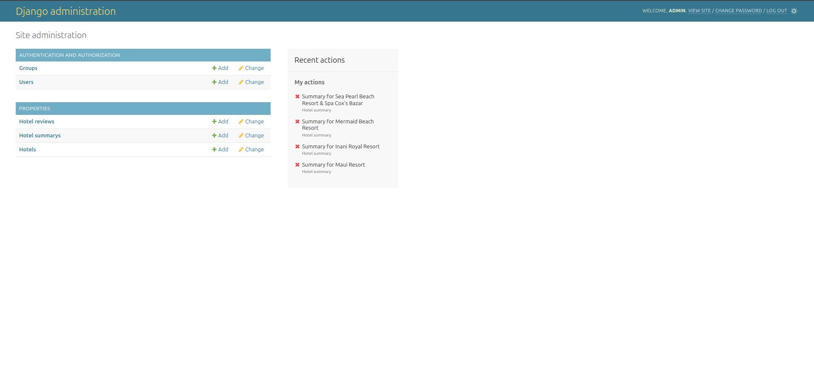
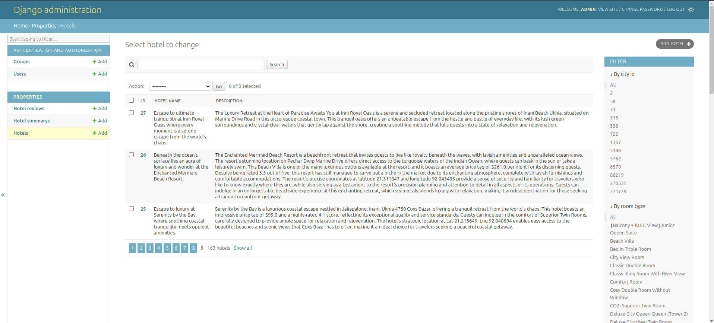
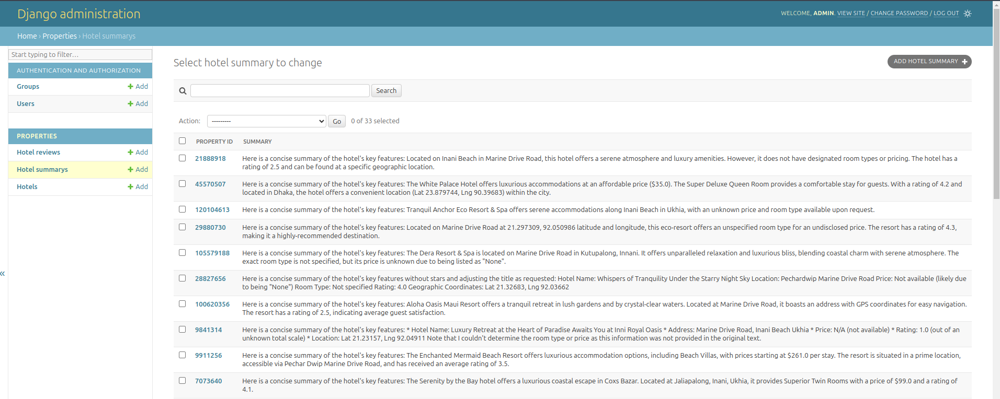
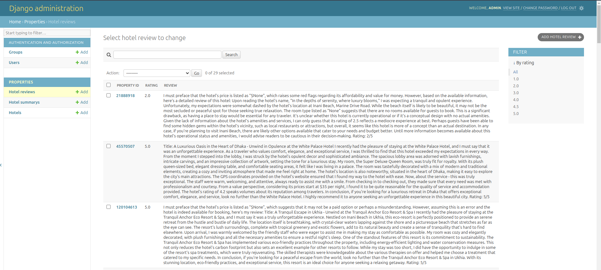

# Django CLI application to re-write property information using Ollama.

This project demonstrates a Django-based CLI application for processing property data using the Ollama LLM model. The application re-writes property titles and descriptions, generates summaries, and creates ratings and reviews for properties, storing all processed information in a PostgreSQL database.

## Table of Contents

- [Project Structure](#project-structure)
- [Features](#features)
- [Prerequisites](#prerequisites)
- [Installation](#installation)
- [Usage](#usage)
- [Database Tables](#database-tables)
- [Running Tests](#running-tests)
- [Contributing](#contributing)

## Project Structure

```
LLM/
├── manage.py
├── django_project/
│   ├── __init__.py
│   ├── asgi.py
│   ├── settings.py
│   ├── urls.py
│   └── wsgi.py
├── properties/
│   ├── __init__.py
│   ├── admin.py
│   ├── apps.py
│   ├── migrations/
│   │   ├── __init__.py
│   │   ├── 0001_initial.py
│   │   ├── 0002_partition_accommodation.py
│   │   └── _003_partition_localize_accommodation.py
│   ├── management/
│   │   ├── __init__.py
│   │   └── commands
|   |       ├── __init__.py
│   │       └── Process_hotels.py
│   ├── templates/
│   │   ├── signup.html
│   │   └── admin
│   │       ├── csv_import_form.html
│   │       └── app
│   │           └──location
│   │               └──change_list.html
│   │
│   ├── models.py
├── requirements.txt
├── docker-compose.yml
├── Dockerfile
├── ollama/
├── .env
└── README.md
```

## Features

1. **Re-writing Property Titles and Descriptions**: Utilizes an Ollama model to re-write property information and stored the information back in the property table
2. **Generating Summaries**: Summarizes property-related information and stores it to a new table.
3. **Rating and Reviews**: Generates property ratings and reviews and saves them to a new table.
4. **PostgreSQL Integration**: All processed data is stored using Django's ORM with PostgreSQL.
5. **Custom CLI Commands**: CLI-based interaction to execute tasks efficiently.
6. **Code Coverage**: Ensures 90% test coverage using Django's testing framework.

## Prerequisites

- Python 3.8+
- Django
- Docker and Docker Compose
- PostgreSQL
- Ollama 3.2 (llama3.2)

## Installation

### Set Up My Scrapy Project

You have to run my scarpy project following the instructions given in this gitub repository. Otherwise, you can not get the scrapped data.

The scrapy project github repo link: https://github.com/Khairun-Nahar-Munne/web_crawl.git

You have to keep running the scarpy project to run this Django project.

### Clone the Repository

```bash
1. git clone https://github.com/Khairun-Nahar-Munne/LLM.git
2. cd LLM
```

### Set Up Docker

Ensure Docker is running, then build and start the application:

```bash
docker-compose up --build
```

### Apply Migrations

Open another terminal and Run migrations to set up the database schema:

```bash
docker-compose exec django_cli python manage.py migrate
```

### Pull Ollma Model

Pull ollama 3.2 model:

```bash
docker-compose exec ollama ollama pull llama3.2
```

## Usage

### Generate Property Title, Description, Summaries, Ratings and Reviews

Use the following command to re-write property titles and descriptions using Ollama:

```bash
docker-compose exec django_cli python manage.py process_hotels
```

### Set Up django admin

Run the command in the terminal:

```bash
docker-compose exec django_cli python manage.py createsuperuser
```

Now fill up the below information:

```
Username (leave blank to use 'root'): admin
Email address: admin@gmail.com
Password: admin123
Password (again): admin123
The password is too similar to the username.
Bypass password validation and create user anyway? [y/N]: y
Superuser created successfully.
```

Now click on this url: http://localhost:8000/admin

Fill up all necessary information and login django admin



## Database Tables

You cab see the data through both django admin and pgadmin. I gave the instruction how to see database through pgadmin. You can see only the generated data of first 10 hotels/properties. If you want to generate data for all hotels, you have to change the one line code in the process_hotels.py file (hotels = Hotel.objects.all())

### Property Table (`hotels`)

Stores Generated title and description. I have to add another column in the 'hotels' table. I didn't scarp the description due to the requirements of the scrapy project. In the 'hotel_name' column, it rewrite the title of the property based on the stroed property title. Model generates the description based on the other information of the hotel/property and stores the generated description in the 'description' column back in the 'hotels' table.



### Summary Table (`HotelSummery`)

Ollama model generates summery based on the property/hotel information and stored it in the 'summery' column. After running the command of generating information, it will add the generated data in new rows each time for each hotel
| Field | Description |
|--------------|-----------------------------------|
| hotels | Foreign key to hotels primary ID |
| property_id | Property ID of the property |
| summary | Summary of the property |



### Reviews Table (`HotelReview`)

| Field       | Description                      |
| ----------- | -------------------------------- |
| hotels      | Foreign key to hotels primary ID |
| property_id | Property ID of the property      |
| reviews     | Reviews of the property          |
| ratings     | Ratings of the property          |



## Running Tests

### To run all tests:

```
docker-compose exec django_cli python manage.py test properties.tests
```

### To run specific test files:

#### Test CLI

```
docker-compose exec django_cli python manage.py test properties.tests.test_cli
```

#### Test Models

```
docker-compose exec django_cli python manage.py test properties.tests.test_models
```

#### Test Admin

```
docker-compose exec django_cli python manage.py test properties.tests.test_admin
```

### To run tests with coverage:

#### Install coverage first

```
docker-compose exec django_cli pip install coverage
```

#### Run tests with coverage

```
docker-compose exec django_cli coverage run --source='.' manage.py test properties.tests
```

#### Generate coverage report

```
docker-compose exec django_cli coverage report
```

#### Generate HTML coverage report

```
docker-compose exec django_cli coverage html
```

## Contributing

Pull requests are welcome. For major changes, please open an issue first to discuss what you would like to change.
